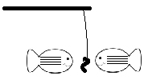

# fish-docs

Model for community gathering of information to improve software documentation

    Give a man a fish and you feed him for a day.
    Teach him how to fish and you feed him for a lifetime.

Ask a question in a forum or chat room. It gets answered. That exchange becomes buried in an archive. With luck it's searchable, and others will find the Q&A, solve the issue of the moment, and move on with their lives. But why do we search forums and chat rooms for answers? Why do we post questions in forums? It's because the answers are either not in documentation, or perhaps the answers are difficult to find.

Sure, there are people who don't bother to read docs, don't bother to search forums, and they'll ask the same question within some number of minutes, hours, or days after someone else. To them, their time is important, and the time of other people is not as important. Let's acknowledge that these people will always exist and dismiss them from this discussion.

The rest of us are now spending a huge amount of our time researching details in a tech world that changes VERY fast. Everything is now a research project. We are doing our homework as independently as possible, and still not finding good answers. 

A more satisfying scenario is when we look at official docs, find our answers, and get on with the actual task we're trying to complete.

The disconnection here is that FOSS developers often don't provide adequate documentation. There's usually no time. We have other things to do in life, like earning money to stay alive. Development time needs to be split between code and support - docs fall down the list. Commercial software is no different. Documentation is often considered a pure expense. And there is where most of us find frustration, in that gap between great software and useful information about how to use it. This can translate into a dwindling user base - users migrate from software when it's difficult to find people who understand it. That results in lost revenue, lost developer interest, and a world of abandoned FOSS and other software.

## fish-docs and how it works

This repo is an experiment with a new concept called "fish-docs", from that "give a man a fish" phrase.

A new doc repo is created for an existing software repo. The name is the original name with "-docs" added ... so whatever "Foo" does, we create "foo-docs", and this is now the fish-docs repo for Foo.

The goal of fish-docs is to serve as a model which can be applied to the documentation for any software. It starts with people who use the software explaining a problem they are trying to solve, and verifying that the solution is hard to find. With some discussion and insight from people who know the software, repo wiki pages are created and modified for review and use by the author in official docs.

This is not a new concept. Documentation for many products is now being curated in GitHub repositories, outside of silos curated by tech writers. The documentation is treated a first-class component, subject to the same kind of discussions, Git management, and updates as software. A fish-docs repo is just another way to organize that process.

Participation from software authors is not required. This is not intended to add even more tasks to long lists of tasks that we all have already. Actually, the model is intended to be used by everyone but the author. Of course author participation can dramatically reduce the time from question to answer. But remember, we're not just looking for answers - this process is here to help improve the documentation so that the author doesn't need to keep answering one-off questions.

Also note that because documentation is created here in GitHub using Markdown, there are no complications with content formatting or tooling, where every author chooses their own tools and formats with their own styling. The goal here is to generate content. Formatting is only suggested here to make the content easy to organize when it's passed back to the author.

In summary: We're trying to discourage people from simply asking for answers to get them through each day. We are not giving "fish" as answers here. We are helping developers to add more fish/information into their sea of official documentation, so that people can more effectively do their own fishing for information.

## Authors/Developers:

Please don't discourage your users from creating or using fish-docs. This is a resource to add to your forums and chat rooms and other channels. Most of us don't have the time to write and maintain good docs. If we can't get others to contibute code, let them contribute their experience outside of forums where all of that data gets buried in temporal archives. Embrace the concept and encourage people to help document your software. Keep an eye on the questions but don't feel compelled to jump to answer questions. Remember: Teach them how to fish, don't be eager to give them fish. We're here to improve your documentation for everyone, not just to answer a question for one person. Learn where your docs need improvement and spend some time there whenever you can. Come back to the foo-docs repo for your Foo software, harvest the new content there to incorporate into your official docs. And be sure to express appreciation for the time that people dedicate to _your_ software.

## Software users:

If you like this model for collaborative documentation, please help your favorite projects by creating and curating a fish-docs repo for them. You don't need to know anything about code. Make this a part of your pay-forward/pay-back for the FOSS and other software that you use. Get others involved to contribute their knowledge in an organized and productive manner. Take some internal time in your company to discuss how staff uses some software, so that you can offer some insightful information to a fish-docs repo. And if you do employ this model, please let us know.

## All

If you believe this model is flawed, please create a ticket, explain your perspective, and offer a suggestion for improvement. Is this a great idea? Dumb? Poorly implemented? Needs a tweak? Create a ticket. Explain why. Let's improve it. Get the idea?

# Using fish-docs

- Create a new repo.
- Replace the content of README.md with fish-docs-README.md
- Optional: Copy in the fish-docs logo: https://github.com/TonyGravagno/fish-docs/blob/main/logo1.jpg
- Modify all references to FISH with details to suit the project.
- Make sure people know about your fish docs.
- Enjoy your fish.

