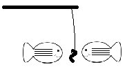

# Introduction to FISH-docs

This project is intended as a workplace, and source of documentation contributions for [FISH](https: github.com/FISH/FISH). This is an independent project, not owned, managed, or "blessed" by anyone other than the creator of this repo,, [Tony Gravagno](https://github.com/TonyGravagno). Here we discuss issues with the newcomer experience, problems getting started, and solutions to those problems. Once we understand a problem that has made it difficult to use FISH, and we create documentation to help others avoid that confusion, we submit the results to [FISH-AUTHOR](https://github.com/FISH-AUTHOR) for evaluation and incorporation into official FISH docs.

The wiki for this repo incorporates the current understandings derived from all discussions on specific topics. This is not a canonical source of accurate information. It is what we believe to be correct right now, could be wrong, and this is submitted to the upstream developer for correction and inclusion in the upstream wiki and other docs. As material here is verified and integrated with the upstream offering, it will be removed from here, as the purpose of this resource is to help to create what does not exist, and not to duplicate what does exist.

# Using this repository

    Give a man a fish and you feed him for a day.
    Teach him how to fish and you feed him for a lifetime.

We are not giving "fish" as answers here, and we're trying to discourage people from simply asking for answers to get them through each day. We want to ensure that there are answers for everyone in a sea of documentation and then point them to that documentation for their answers.

This repository is based on the [fish-docs](https://github.com/TonyGravagno/fish-docs) model.

How to use this repository

 

This [fish-docs](https://github.com/TonyGravagno/fish-docs) repo is for discussion about newcomer issues, getting started, the onboarding experience, and daily challenges. Your goal here is to improve the documentation so that it answers your question. You are <b>giving</b> your time toward that goal.

When creating a new Issue, there are two templates, the Question template and the Answer template.

Asking Questions

 
Create an Issue here using the Question template if you believe specific information is difficult to find or not organized well. Discussion about these issues will lead to changes in the local wiki. The goal is to start with "this is difficult to understand", and end with "we now have a clear explanation".

Your purpose here, when you ask a question, is not just to get an answer, but to point out that information is difficult to find on the topic. Tell us where you have looked and why existing text is inadequate. If you do not verify that you have read existing documentation, your Issue may earn the red RTFM label.

### Constructing a good query
Rather than posting a "half-baked" question, please take some time to construct a well-formed question. Collect your questions in some note-taking tool, then research the topic. Gather related links - like where you expect to find answers but did not, and where you found partial answers. When you have done your homework, check your notes for clarity, and then create an Issue here.

 

Answering Questions and Providing New Information

 
You do not need to be a newbie to post an Issue here. If you are an expert with this software, you have insight into "I wish I knew this when I got started", and that is valuable to others. Please create an Issue here using the Answer template, to describe a concept and explain something that you know which is not present or not clear in the official documentation.

Please also contribute your knowledge in response to open Issues/questions. If you are going to tell someone to RTFM, you must link to the FM where the specific answer is found. If you cannot do that, then the point is verified that the answer is not clear or easy to find. That is the whole point of this resource.

Your objective here, when you answer a question, is not just to provide an answer. We love StackOverflow and related Q&A sites. This is not a resource for basic Q&A. Your objective here is to provide some insight that explains where you got your information, or how you learned the solution, and what others can do to improve their understanding in this area. Simple answers are helpful but the goal of this fish-docs repo is to help people to understand the topics, and to be aware of valued information resources, so that they can answer other questions in the same area without constant reference back to forums, chat, and other channels.

Don't worry about being eloquent in responses, formatting, or about creating wiki content. The focus is to identify issues with newcomer "onboarding", and to gather information to minimize those issues. From there anyone can translate wisdom from threada into new and enhanced wiki content. However, do feel free to propose wiki text in Issue comments with or without formatting for others to critique. The owner of this repo accepts responsibility for wiki updates on this repo, and the wiki itself might be opened for PR's.

How Not to use this repository

 

Your goal is not just to <b>take</b> an answer. This is not a dumping ground for "just tell me what I want to know" Q&A. Simple Q&A discussions do not fit the purpose of this resource. For a quick answer, use all of the other resources in the world that are available, including forums, chat, blogs, sites in the StackOverflow network, etc.

This is not a place to report issues with the FISH software. To be clear, in this repo we don't care about functionality that is broken, we do care about features that are undocumented or under-documented. Also, once documentation is published by the author, fixing it is in their realm. For example, posting here that "the doc has a typo" will not result in a doc fix. However, this is a good place for "what are all of the flags that can be used with Foo ... that info is not on doc page ...docs/foo...".

 

